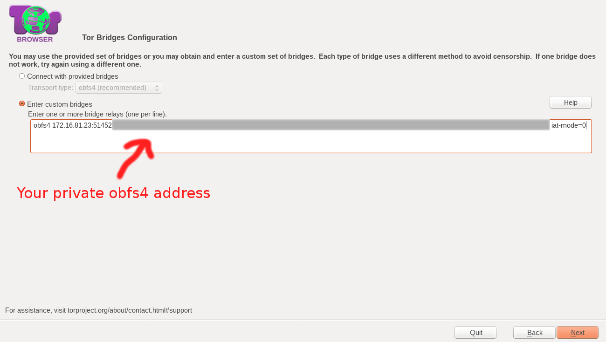

# Setup a private obfs4 Tor bridge

## Ubuntu server 16.04.3 LTS

Copy script to your server:

```bash
wget https://raw.githubusercontent.com/Xaqron/tor-private-bridge/master/ubuntu-server-16.04.3-LTS.sh -O tor-bridge.sh
```

## Usage Example

```bash
sudo bash tor-bridge.sh 172.16.81.23 51452 59009
```

### In above example

* `172.16.81.23` is your server public IP address.
* `51452` is the listening port of tor service.
* `59009` is ORPort.

For more security change `listening port` and `ORPort` to a random number of your own.

When setup finished you will get an obfs4 address which can be used in tor browser.

Also your `obfs4` address will be saved at `obfs4.address` file in your home directory.



### Contact me [@Xaqron](https://twitter.com/xaqron)
